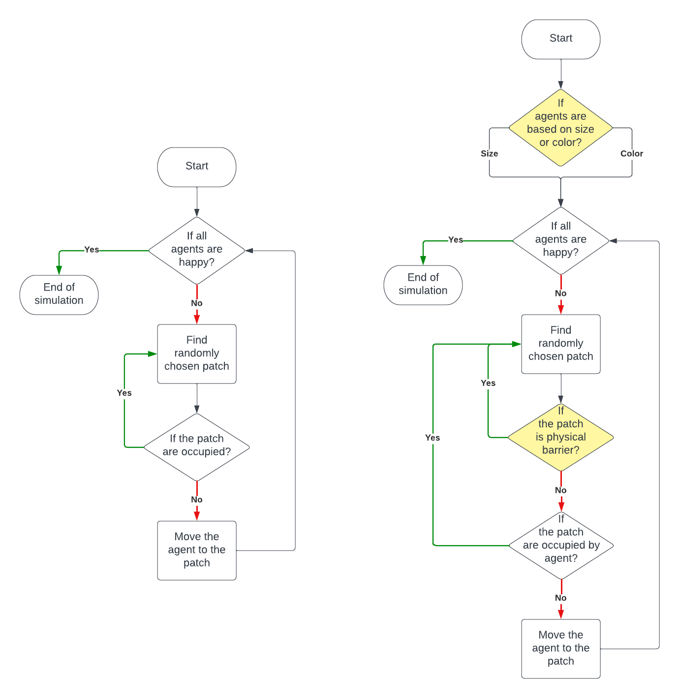

# Modifying Segregation Model

## Description
This project simulates the behavior of two types of agents (orange and blue) residing in a community. The agents have preferences for living near their own type, which leads to spatial patterns of segregation. This simulation explores how individual preferences can manifest into broader social dynamics, highlighting the processes that contribute to segregation in urban environments.

## Inspiration
The model is inspired by the work of Thomas Schelling, who investigated social systems and residential arrangements in urban areas. By simulating the behaviors of agents with individual preferences, we can observe the emergence of complex patterns and understand the underlying mechanisms driving social segregation.

## Goal of the Model
The primary goal of this simulation is to demonstrate how personal inclinations for living near similar agents can result in large-scale patterns of segregation. Specifically, the model examines:

- The dynamics of agent interactions based on their color.
- How individual preferences influence overall community composition.
- The effects of physical barriers on agent movement and segregation patterns.

## Features
- **Agent Types**: Two types of agents (orange and blue) representing distinct groups.
- **Happiness Metric**: Agents can be happy or unhappy based on the percentage of similar neighbors they have.
- **Physical Barriers**: The model includes walls and obstacles that agents must navigate, affecting their movement and interaction.
- **User Customization**: Users can set parameters for agent density, wall density, and preferences for color or size.

## Reasons for Choosing the Model
The segregation model is intriguing because it illustrates how simple individual preferences can lead to complex patterns of segregation at the societal level. This model not only sheds light on social dynamics related to race and ethnicity but also applies to other dimensions such as age, gender, and socioeconomic status. By modifying the model to include physical barriers and additional agent attributes, we can gain deeper insights into the factors that perpetuate segregation and explore potential interventions for fostering more inclusive communities.

## Agents
Agents in the simulation represent individuals in a community, characterized by their color (orange or blue) and a new attribute, size. The agents express their preference for nearby neighbors, and their happiness is determined by the proportion of similar-colored agents in their vicinity. Key variables include:

- **Density**: The density of agents in the grid.
- **%-similar-wanted**: The percentage of similar agents each agent desires as neighbors.
- **happiness**: A boolean indicating whether an agent meets its neighbor preference.

### Global Variables
The model tracks several global statistics:

- **percent-similar**: The average percentage of an agent’s neighbors that are the same color.
- **percent-unhappy**: The percentage of agents that are unhappy with their neighbors.

## Existing Functions and Procedures
1. **Setup**: Initializes the simulation, creating agents and setting their initial properties. Randomly places walls according to the user-defined wall density.
2. **Go**: Advances the simulation by one tick, checking for happiness and moving unhappy agents.
3. **Move Unhappy Turtles**: Facilitates movement for agents that are unhappy, finding new locations to occupy.
4. **Find New Spot**: Identifies unoccupied patches for agents to move to while avoiding walls.
5. **Update Globals**: Updates statistics related to agent distribution and happiness.

## Modifications
In this project, significant modifications were made to enhance the model:

- **Obstacle Navigation**: Agents now avoid physical barriers during movement.
- **Size Attribute**: An additional attribute (size) was introduced, allowing users to focus on different characteristics when analyzing segregation.
- **User Interface Enhancements**: A Chooser was added to allow users to select whether to focus on color or size, and sliders to adjust agent density and wall density dynamically.

## Simulations and Results
The simulation results indicate that the presence of walls impacts agent movement and segregation patterns. Key observations include:

1. Increased wall density leads to longer simulation times as agents navigate around obstacles.
2. High wall density can result in infinite simulation scenarios where agents are unable to segregate due to limited space.
3. Regardless of focusing on size or color, walls consistently hinder rapid segregation.

### Experiment Results
An experiment was conducted to analyze the impact of wall density on segregation patterns, with fixed parameters set for agent density and desired similarity percentage. The results demonstrated a direct correlation between wall density and simulation performance.

| Wall Density [%] | Average Steps | Average Wall Count |
|-------------------|---------------|---------------------|
| 0                 | 18.5          | 0                   |
| 10                | 18.3          | 25.4                |
| 20                | 19.6          | 51.8                |
| 30                | 17.5          | 79.2                |
| 40                | 17.7          | 103.5               |
| 50                | 20.1          | 128.9               |
| 60                | 19.1          | 152.3               |
| 70                | 22.1          | 179.7               |
| 80                | 25             | 206.8               |
| 90                | 28             | 230.7               |

## Conclusions
The project successfully demonstrated how individual preferences and physical barriers can shape segregation patterns within a community. The presence of walls significantly affects agent behavior, highlighting the need to consider such factors in urban planning and social policy. The results provide valuable insights into the dynamics of segregation, suggesting that thoughtful design of community spaces could mitigate social divisions.

## Practical Applications
This research has practical implications in various fields, including:

- **Urban Planning**: Informing the design of inclusive public spaces.
- **Policy-Making**: Providing data to shape policies aimed at reducing social inequality.
- **Game Development**: Creating more realistic simulations of social dynamics.
- **Crowd Management**: Developing effective strategies for managing social interactions in public spaces.

## Acknowledgments
Special thanks to Thomas Schelling for his foundational work in understanding segregation dynamics, and to the developers of NetLogo for providing a robust platform for agent-based modeling.

## License
This project is licensed under the MIT License - see the [LICENSE](LICENSE) file for details.
